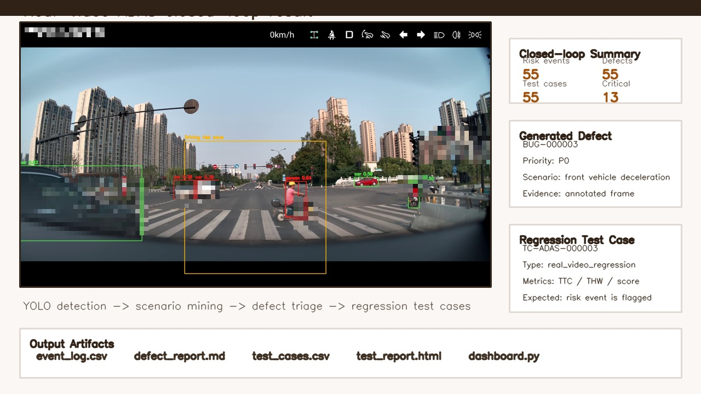
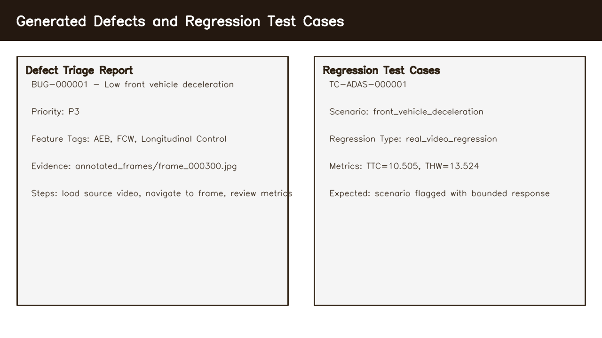
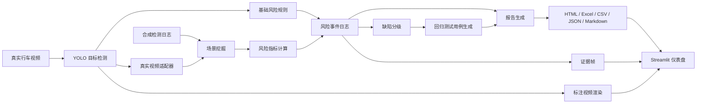

# ADAS 场景风险挖掘与回归测试平台

本地 ADAS 测试工具，用于道路视频分析、场景风险挖掘、缺陷分级和回归测试用例生成。

读取行车视频，检测道路目标，基于规则生成风险事件，并输出缺陷记录与回归测试用例。





## 工作流程

项目包含两条工作路径。

**真实视频闭环路径**

- 读取本地行车视频。
- 使用 YOLOv8 识别道路目标。
- 记录道路场景风险事件。
- 保存证据帧。
- 生成带识别框和风险提示的新视频。
- 将采样检测结果转换为 ADAS 场景事件。
- 输出缺陷报告和回归测试用例。

**合成场景回归路径**

- 生成确定性的 ADAS 风格检测日志。
- 挖掘跟车过近、前车减速、行人横穿、加塞和车道偏离风险等场景。
- 计算 TTC、THW、相对速度、距离和风险评分。
- 生成缺陷记录。
- 生成回归测试用例。
- 导出报告、图表和证据帧。

## 核心能力

- 基于 YOLOv8 的道路目标检测。
- 真实视频风险事件记录，包括时间戳、目标类别、风险等级、证据帧和测试备注。
- 真实视频检测结果适配到 ADAS 场景挖掘流程。
- 标注视频渲染，支持检测框、风险区域和风险提示叠加。
- 合成 ADAS 数据生成，便于无私有视频时进行可复现实验。
- 场景挖掘：跟车过近、前车减速、行人横穿、加塞、车道偏离风险。
- 风险指标计算：TTC、THW、相对速度、距离、风险评分。
- 缺陷分级：优先级、功能标签、触发条件、复现步骤、证据路径。
- 回归测试用例生成：场景类型、关联事件、关联缺陷、预期结果、评估指标。
- 多格式输出：HTML、CSV、Excel、JSON、Markdown、图表和 Streamlit 仪表盘。
- 自动化测试覆盖风险规则、指标计算、场景挖掘、缺陷分级、报告生成和视频渲染。

## 系统架构



详细设计见 [docs/architecture.md](docs/architecture.md)。

## 快速开始

建议使用 Python 3.10 或更高版本。

```powershell
python -m venv .venv
.venv\Scripts\activate
python -m pip install -r requirements.txt
```

## 运行合成场景回归流程

该流程不依赖私有行车视频，适合快速验证完整闭环。

```powershell
python src/main.py --generate-synthetic --output outputs
python src/main.py --use-synthetic-detections --output outputs
```

典型输出：

- `outputs/event_log.csv`
- `outputs/risk_events.xlsx`
- `outputs/test_cases.xlsx`
- `outputs/test_cases.csv`
- `outputs/defect_report.md`
- `outputs/summary.json`
- `outputs/test_report.html`
- `outputs/evidence_frames/*.jpg`
- `outputs/charts/*.png`

示例输出文件见 [docs/sample_outputs](docs/sample_outputs)。

## 运行真实视频闭环流程

将本地行车视频放入 `data/raw/`。原始视频不会被 Git 跟踪。

```powershell
python src/main.py --video data/raw/test111.mp4 --output outputs/test111
```

真实视频闭环报告会生成在：

- `outputs/test111/adas_closed_loop/event_log.csv`
- `outputs/test111/adas_closed_loop/defect_report.md`
- `outputs/test111/adas_closed_loop/test_cases.csv`
- `outputs/test111/adas_closed_loop/test_report.html`

生成带识别框的新视频：

```powershell
python src/main.py --video data/raw/test111.mp4 --render-video --render-stride 1 --output outputs/test111
```

## 本地仪表盘

```powershell
streamlit run dashboard.py
```

仪表盘支持：

- 在不同输出结果之间切换。
- 查看风险事件数量、风险等级分布和场景类型分布。
- 浏览风险事件表。
- 预览证据帧。
- 播放已生成的标注视频。

## 测试

```powershell
python -m pytest tests
python -m compileall src tests
python -m py_compile dashboard.py
```

## 项目结构

```text
configs/
data/
docs/
scripts/
src/
tests/
dashboard.py
requirements.txt
```

## 当前限制

- 真实视频闭环已可生成缺陷和回归测试用例。
- TTC 和 THW 基于检测框几何关系估算，适用于离线测试演示。
- YOLOv8n 是通用预训练检测器，可能存在漏检或误检。

## 后续计划

1. 增强真实视频目标跟踪，提高相对速度和 TTC 的稳定性。
2. 增加人工复核标签，例如真阳性、假阳性、待复核和缺陷已确认。
3. 在仪表盘中增加场景类型、功能标签、优先级和复核状态筛选。
4. 扩展持续集成流程，覆盖无需私有视频即可运行的合成场景链路。

## 隐私说明

请不要提交原始行车视频、人脸、车牌、精确位置、大型渲染视频或生成报告。`.gitignore` 已默认排除这些文件。
