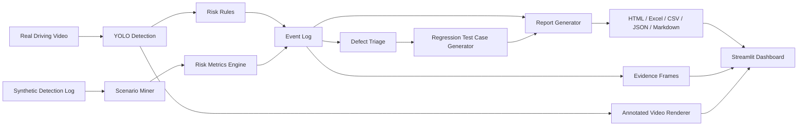

# System Architecture

This project is organized around a testing workflow rather than a single model demo. The goal is to move from observation to risk event, then from risk event to defect and regression-test artifacts.

## High-Level Flow



## Components

| Component | File | Responsibility |
| --- | --- | --- |
| CLI entry point | `src/main.py` | Parses commands and runs real-video, synthetic-data, and rendering flows. |
| Detector | `src/detector.py` | Runs YOLOv8 inference on video frames. |
| Risk rules | `src/risk_rules.py` | Applies frame-level road-scene rules for the real-video path. |
| Synthetic data | `src/synthetic_data.py` | Creates deterministic ADAS-style detection logs for repeatable demos. |
| Scenario miner | `src/scenario_miner.py` | Finds ADAS scenario events from structured detections. |
| Risk metrics | `src/risk_metrics.py` | Computes TTC, THW, distance, relative speed, and risk scores. |
| Defect triage | `src/defect_triage.py` | Converts scenario events into prioritized defect records. |
| Test-case generator | `src/test_case_generator.py` | Converts defects into regression test cases. |
| Report generator | `src/report_generator.py` | Exports CSV, Excel, JSON, Markdown, HTML, charts, and evidence frames. |
| Video renderer | `src/video_renderer.py` | Produces annotated videos with detection boxes and risk overlays. |
| Dashboard | `dashboard.py` | Presents generated outputs in a local Streamlit interface. |

## Current Data Paths

### Real-Video Path

The real-video path is designed for local driving videos:

```text
video -> sampled frames -> YOLO detections -> frame risk rules -> event log -> reports/evidence
video -> full or strided frames -> YOLO detections -> annotated_video.mp4
```

Current outputs include CSV, Excel, JSON, HTML, annotated evidence frames, optionally an annotated MP4, and an `adas_closed_loop/` subreport with defects and regression test cases.

### Synthetic Regression Path

The synthetic path is designed for repeatable ADAS engineering demos:

```text
synthetic detections -> scenario mining -> risk metrics -> defects -> regression test cases -> reports/evidence/charts
```

This path currently demonstrates the complete closed loop from scenario event to defect and regression test case.

## Important Boundary

The full defect-triage and regression-test generation loop is now implemented for both synthetic detections and sampled real-video detections.

The real-video path uses `src/real_video_adapter.py` to convert YOLO observations into the same structured scenario schema used by `src/scenario_miner.py`. This first version estimates distance from bounding-box geometry and assigns lane regions from horizontal object position. It is suitable for offline testing workflow demonstration, but not for production-grade vehicle validation.
